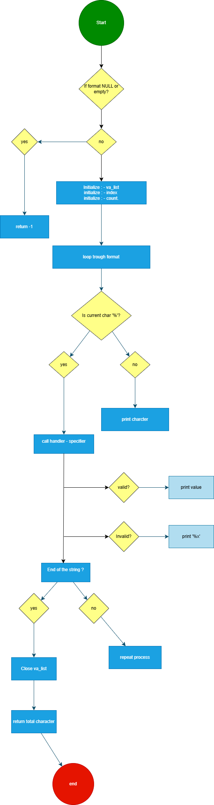

# Printf Project 

## Description

`_printf` permet d'afficher des  formar avec des spécificateurs de conversion.

## Fonctionnalités implémentées

- Gestion des spécificateurs de conversion :
  - `%c` : Affiche un caractère
  - `%s` : Affiche une chaîne de caractères
  - `%%` : Affiche le caractère `%`
  - `%d` : Affiche un entier signé
  - `%i` : Affiche un entier signé

## Compilation

Votre code sera compilé avec la commande suivante :
```sh
gcc -Wall -Werror -Wextra -pedantic -std=gnu89 -Wno-format *.c
```
la commande d'exécution
```
./printf
```

## Flowchart




## Utilisation

Voici un exemple d'utilisation de `_printf` :
```c

int main(void)
{
    len = _printf("Affichage d'un entier : %d\n", 42);
}
```

## Normes de codage

- Respect des normes Betty
- Pas de variables globales
- Maximum de 5 fonctions par fichier
- les fichiers sont terminés par une nouvelle ligne

## Auteurs

- Warren Gomes martins
- Myriam Mezhoud