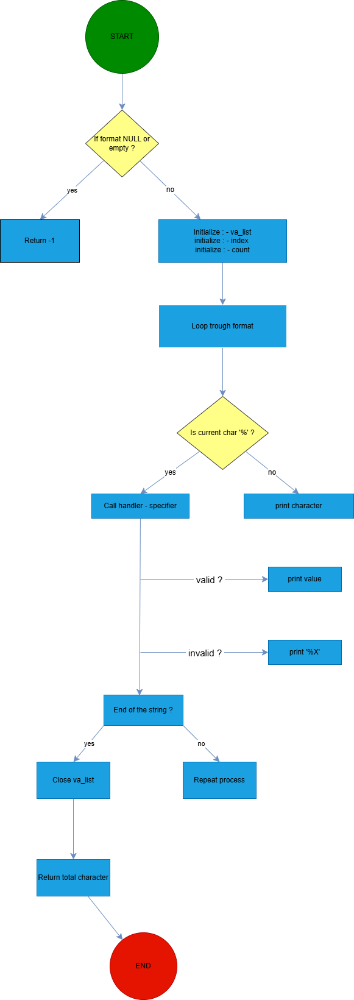

# _Printf Project 

## Description
The `_printf` project is much more than just a custom implementation of the standard printf function in C. It is the result of true teamwork, where collaboration, idea sharing, and mutual support were at the heart of every step. By working together, we were able to: improve our understanding of C mechanics, solve technical problems efficiently, and produce well-structured code through mutual reviews. This project demonstrates the benefits of teamwork in software development, especially in terms of creativity and efficiency.

## Coding standards for the project

### General
- Allowed editors: `vi, vim, emacs`
- All the files will be compiled on Ubuntu 20.04 LTS using `gcc`, using the options `-Wall -Werror -Wextra -pedantic -std=gnu89`
- All the files should end with a new line
- A `README.md` file, at the root of the folder of the project is mandatory
- Code should use the `Betty` style. It will be checked using betty-style
- Not allowed to use global variables
- No more than 5 functions per file
- In the following examples, the `main.c` files are shown as examples. Can use them to test your functions, but you don’t have to push them to your repo (if you do we won’t take them into account). We will use our own `main.c` files at compilation; do not push your own `main.c` file. Our `main.c` files might be different from the one shown in the examples
- The prototypes of all the functions should be included in your header file called `main.h`
- Don’t forget to push your header file
- All the header files should be include guarded

## GitHub

There should be one project repository per group. If you clone/fork/whatever a project repository with the same name before the second deadline, you risk a 0% score.

## Main provided
```
#include <limits.h>
#include <stdio.h>
#include "main.h"

/**
 * main - Entry point
 *
 * Return: Always 0
 */
int main(void)
{
    int len;
    int len2;
    unsigned int ui;
    void *addr;

    len = _printf("Let's try to printf a simple sentence.\n");
    len2 = printf("Let's try to printf a simple sentence.\n");
    ui = (unsigned int)INT_MAX + 1024;
    addr = (void *)0x7ffe637541f0;
    _printf("Length:[%d, %i]\n", len, len);
    printf("Length:[%d, %i]\n", len2, len2);
    _printf("Negative:[%d]\n", -762534);
    printf("Negative:[%d]\n", -762534);
    _printf("Unsigned:[%u]\n", ui);
    printf("Unsigned:[%u]\n", ui);
    _printf("Unsigned octal:[%o]\n", ui);
    printf("Unsigned octal:[%o]\n", ui);
    _printf("Unsigned hexadecimal:[%x, %X]\n", ui, ui);
    printf("Unsigned hexadecimal:[%x, %X]\n", ui, ui);
    _printf("Character:[%c]\n", 'H');
    printf("Character:[%c]\n", 'H');
    _printf("String:[%s]\n", "I am a string !");
    printf("String:[%s]\n", "I am a string !");
    _printf("Address:[%p]\n", addr);
    printf("Address:[%p]\n", addr);
    len = _printf("Percent:[%%]\n");
    len2 = printf("Percent:[%%]\n");
    _printf("Len:[%d]\n", len);
    printf("Len:[%d]\n", len2);
    _printf("Unknown:[%r]\n");
    printf("Unknown:[%r]\n");
    return (0);
}
```
## Excecution -> Expected output

```
alex@ubuntu:~/c/printf$ gcc -Wall -Wextra -Werror -pedantic -std=gnu89 -Wno-format *.c
alex@ubuntu:~/c/printf$ ./printf
Let's try to printf a simple sentence.
Let's try to printf a simple sentence.
Length:[39, 39]
Length:[39, 39]
Negative:[-762534]
Negative:[-762534]
Unsigned:[2147484671]
Unsigned:[2147484671]
Unsigned octal:[20000001777]
Unsigned octal:[20000001777]
Unsigned hexadecimal:[800003ff, 800003FF]
Unsigned hexadecimal:[800003ff, 800003FF]
Character:[H]
Character:[H]
String:[I am a string !]
String:[I am a string !]
Address:[0x7ffe637541f0]
Address:[0x7ffe637541f0]
Percent:[%]
Percent:[%]
Len:[12]
Len:[12]
Unknown:[%r]
Unknown:[%r]
alex@ubuntu:~/c/printf$
```

## Implemented Features

Handling of conversion specifiers:

- `%c`: Displays a single character

- `%s`: Displays a string of characters

- `%%`: Displays the % character

- `%d`: Displays an integer

- `%i`: Displays an integer (same usage as %d)

## Compilation

Your code will be compiled with the following command:
```sh
gcc -Wall -Werror -Wextra -pedantic -std=gnu89 -Wno-format *.c
```

## Utilisation

```c

#include "main.h"

int main(void)
{
    _printf("Character: %c\n", 'H');
    _printf("String: %s\n", "Hello, world!");
    _printf("Integer: %d\n", 42);
    _printf("Negative number: %i\n", -123);
    _printf("Percentage: %%\n");
    _printf("Combination: %c %s %d%%\n", 'A', "test", 100);

    return (0);
}

```

Expected output :

```text

Character: H
String: Hello, world!
Integer: 42
Negative number: -123
Percentage: %
Combination: A test 100%
```
## Man page
```
_printf(3)		Manual page

NAME
	_printf - custom ouput formatting function

SYNOPSIS

	#include "main.h"

	int _printf(const char *format, ...);

DESCRIPTION

	_print produces output formatted according to the specifications described below (similar to the printf function).

	The format may contain conversion directives beginning with '%'.

	Supported format specifiers:
	
		%c : prints a single character

		%s : prints a string

		%d : prints a decimal number

		%i : prints an integer in base 10 (same use as %d)

		%% : prints a literal % character

RETURN VALUE

	- On success, returns the number of characters printed (excluding the terminating null byte).
	- Returns -1 if format is NULL or empty.

EXAMPLES

	Printing a single character:
		_printf("Character: [%c]\n", 'H');

	Printing a string: 
		_printf("String: [%s]\n", "Hello");

	Printing a percent sign:
		_printf("Percentage: [%%]\n");

	Printing an positive integer:
		_printf("Number: [%d]\n", 123);

	Printing a negative integer:
		_printf("Negative number: [%i]\n", -123);

	Printing a combination of types:
		_printf("Character: [%c], String: [%s], Integer: [%d]\n", 'X', "Test", 42);

DATE

	25 March 2025

AUTHOR

	Warrre and Mylliah
  ```

## Flowchart



## Auteurs

- [Warrre Git Hub](https://github.com/Warrre)
- [Mylliah Git Hub](https://github.com/Mylliah)
